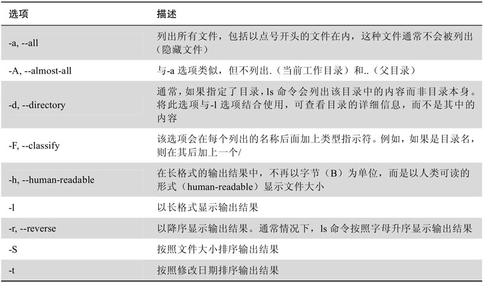
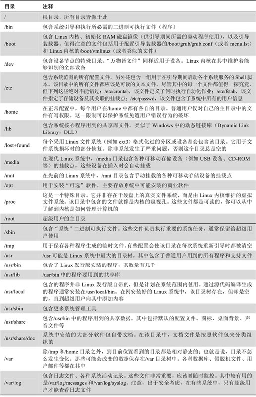
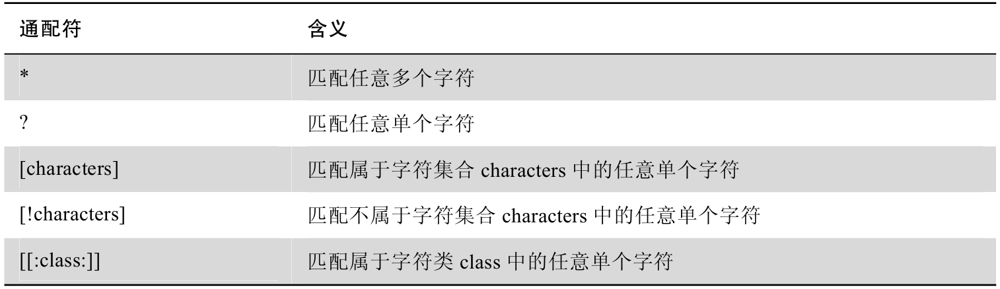
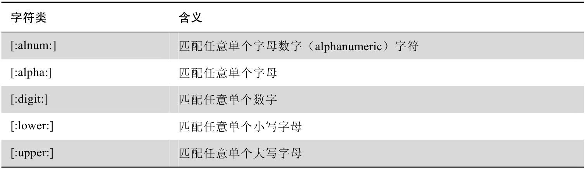
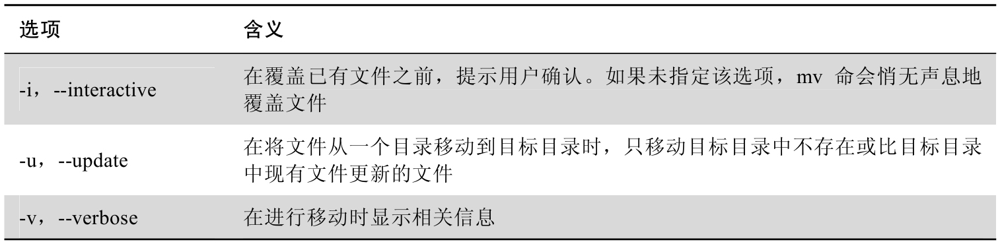
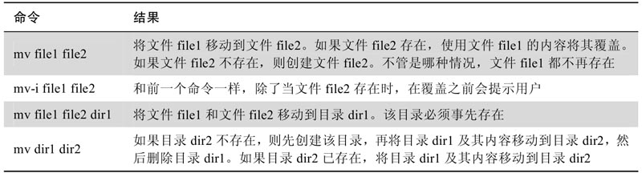
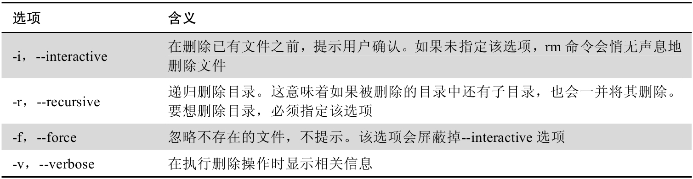
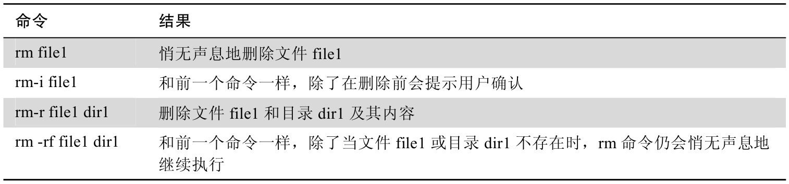

# Linux命令大全

## 1. 学习shell

`df`：查看当前硬盘空间。

`free`：查看当前内存可用容量。

`pwd`：输出当前的工作目录名称。

`ls`：列出目录内容。

```shell
ls 
ls /usr
ls-a	# 列出目录内容（包含以`.`开头的隐藏文件）。
ls ~ /usr		# 同时显示用户主目录和/user下的内容
ls -l		# 将输出的结果显示为长格式
ls -t		# 将输出的结果按时间排序
ls -lt	# 将输出的结果
```



`cd`：修改目录。

```shell
cd
cd -	# 切换到上一级目录。
cd ~username	# 将当前目录更改为用户username的主目录。
```

`file`：确定文件类型，会输出文件内容的简要描述。**在类UNIX系统中（如Linux），存在一个普遍观念：万物皆文件（everything is a file）。**

`less`：查看文本文件。


**Linux系统中的目录**




### 1.4 操作文件和目录

`mkdir`：创建目录。

`cp`：复制文件和目录。

`mv`：移动和重命名文件和目录。

`rm`：删除文件和目录。

`ln`：创建硬链接和符号链接。






```shell
mkdir directory...
mkdir dir1
mkdir dir1 dir2 dir3
```

```shell
cp item1 item2	# 将单个文件或目录item1复制到文件或目录item2
cp item... directory
```

```shell
mv item1 item2	# 将单个文件或目录item1重名命为item2或移动到item2
mv item... directory	# 
```





```shell
rm item...
```





```shell
ln file link
ln -s item link
```

### 1.5 和命令打交道

```shell
type command
type type	# type is a shell builtin
type ls # ls is aliased to 'ls --color=tty'
type cp	# cp is /bin/cp

# type 也可以用来测试某个命令是否已被占用
```

```shell
which ls	# /bin/ls
```

```shell
help
help cd
```

```shell
man program
man ls
```

```shell
apropos	# 显示适合的命令清单
apropos partition
```

```shell
whatis ls	# ls (1)       - list directory contents
```

```shell
info ls
```

```shell
cd ..; ls; cd -
```

```shell
alias 'string'
alias foo='cd /usr; ls; cd -'
type foo

unalias foo
type foo
```

### 1.6 重定向

